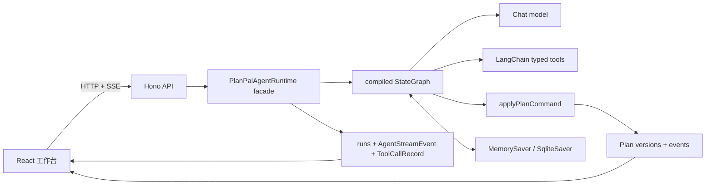
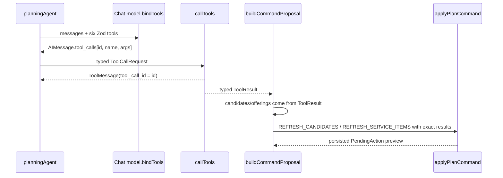

# PlanPal Agent 架构

PlanPal 的 Agent 主链路是一个真正由 API 调用的 LangGraph `StateGraph`。`PlanPalAgentRuntime` 只负责创建/恢复 run、编译 graph、消费 graph stream 和持久化稳定事件；它不再用大型 `if/else` 编排业务分支。

最重要的边界保持不变：模型和工具都不能直接写 `Plan`，任何 mutation 都必须经过 `applyPlanCommand()`。

## 总体架构



代码入口：

- Graph 定义：`packages/agent/src/graph.ts`
- Graph state：`packages/agent/src/state.ts`
- Zod schemas：`packages/agent/src/schemas.ts`
- Context nodes：`packages/agent/src/nodes/context.ts`
- Planning/tool nodes：`packages/agent/src/nodes/planning.ts`
- Interrupt/apply nodes：`packages/agent/src/nodes/approval.ts`
- Runtime facade：`packages/agent/src/runtime.ts`
- Graph event 映射：`packages/agent/src/runtime-stream.ts`
- Graph custom stream 事件：`packages/agent/src/graph-stream.ts`
- OpenAI-compatible 请求与流式适配：`packages/agent/src/model.ts`
- API wiring：`apps/api/src/store.ts`、`apps/api/src/index.ts`
- Sites Worker store override：`scripts/sites-worker-store.ts`

## Graph state

`PlanPalGraphState` 使用 `StateSchema` 定义，可被 checkpointer 序列化。主要字段是：

| 字段 | 用途 |
| --- | --- |
| `messages` | 多轮 LangChain messages；使用 `MessagesValue` reducer |
| `planId` / `runId` / `baseVersion` | 稳定身份和 optimistic version guard |
| `plan` | 当前加载的 Plan 快照 |
| `intent` / `route` | Zod 校验后的意图和路由 |
| `toolCalls` | 原生 tool call；按 call id append/upsert reducer |
| `toolResults` | 工具结果；按 `toolCallId` append/upsert reducer |
| `proposedCommands` | Zod 校验后的 `PlanCommandProposal` |
| `pendingApproval` / `resume` | typed interrupt 和 typed resume |
| `response` / `resultPlan` | 最终结构化响应和结果 Plan |
| `error` | 可恢复/不可恢复 graph error |
| `metadata` | node path、fallback 原因、model/tool 次数和 continuation |

`messages`、`toolCalls` 和 `toolResults` 都不会被后续节点无意覆盖。每个 plan 使用稳定 `thread_id = plan:${planId}`，因此同一个计划的消息历史和 interrupt checkpoint 可以跨 run 延续。

## 节点和条件边

Graph 包含 12 个节点：

| 节点 | 责任 |
| --- | --- |
| `loadContext` | 从 Plan store 重新加载权威 Plan 和 base version |
| `understandIntent` | 模型 structured intent；失败修复一次后 deterministic fallback |
| `routeIntent` | 生成 `qa / candidate-search / service-search / mutation / clarification / confirmation` |
| `qaAgent` | 使用多轮 messages 回答，只读 Plan |
| `planningAgent` | 让模型绑定 tools 并产生 `AIMessage.tool_calls` |
| `callTools` | 执行 tool call，返回关联的 `ToolMessage` |
| `buildCommandProposal` | 只使用已返回的 tool result 构建 proposal |
| `validateProposal` | Zod 校验并通过 `PlanCommand` 生成可持久化 preview |
| `requestApproval` | 调用 LangGraph `interrupt(payload)` |
| `applyCommand` | 校验 action/run/plan/version，恢复后执行 domain command |
| `finalize` | 生成 `FinalAgentResponse` |
| `handleError` | tool/model/domain failure 的 clarification 或终止策略 |

真实条件边包括：

```text
START -> loadContext
loadContext -- ok/error --> understandIntent | handleError
routeIntent -- qa/candidate-search/service-search/mutation/clarification/confirmation/error
planningAgent -- tools/proposal/error --> callTools | buildCommandProposal | handleError
callTools -- success/failure --> buildCommandProposal | handleError
validateProposal -- ok/error --> requestApproval | handleError
applyCommand -- ok/planning/intent/error --> finalize | planningAgent | understandIntent | handleError
handleError -- retry/finish --> buildCommandProposal | finalize
finalize -> END
```

其中 `planning` continuation 用于“换一个”，`intent` continuation 用于 clarification 回答。它们仍走 graph 边，而不是跳出 graph 回到 runtime 手工分派。

## 关键调用链

### QA

```text
POST /agent/runs
  -> graph.stream(..., streamMode = ["updates", "custom"])
  -> loadContext -> understandIntent -> routeIntent(qa)
  -> qaAgent -> finalize
  -> SSE graph/model/message/run events
```

### 原生 tool calling 与候选 grounding



工具由 LangChain `tool()` 和 Zod 参数 schema 定义：

- `poi_search`
- `offering_search`
- `route_estimate`
- `weather_check`
- `order_preview`
- `get_current_plan`

模型产生的 `AIMessage.tool_calls[].id` 会原样进入 `ToolMessage.tool_call_id`、`ToolResult.toolCallId`、`ToolCallRecord` 和 trace。工具最多尝试两次；失败或空候选进入 typed clarification。模型没有调用预期工具时，graph 记录 fallback 原因并产生同 schema 的 deterministic tool call。

候选和服务结果不会在 domain 中重新搜索：`REFRESH_CANDIDATES.candidates` 和 `REFRESH_SERVICE_ITEMS.offerings` 直接携带经过 tool result grounding 的数据。

### Structured output

四个核心结构均由 Zod 定义：

- `AgentIntent`
- `AgentRoute`
- `PlanCommandProposal`
- `FinalAgentResponse`

模型 intent 使用 `withStructuredOutput(..., method: "jsonMode")` + Zod；真正的 function calling 留在 planning/tool 边界。schema/JSON 解析失败会自动修复/重试一次；第二次失败后使用 deterministic intent，并在 `metadata.fallbackReasons` 和 `agent.model.error` trace 中记录原因。网络、认证和 provider 可用性错误不会被当成 schema 错误吞掉，而是进入 `failed` 终态。

对否定删除、替换、服务和确认等关键意图还有 deterministic guard。例如模型若把“把晚饭换近一点”解释成原地 rewrite，graph 会记录 `intent-guard` 并进入 `poi_search` 候选链。

### Human-in-the-loop

`requestApproval` 执行真实 `interrupt()`。payload 包含：

```text
actionId, runId, planId, baseVersion, kind, action
```

当前对话 Graph 统一支持 command approval、candidate selection、service selection 和 clarification。API 恢复时使用同一 `thread_id` 调用：

```ts
graph.stream(new Command({ resume: typedResume }), config)
```

LangGraph 从 checkpoint 恢复并重新进入 interrupt 节点，然后继续 `applyCommand`；`loadContext`、intent、tool 等 interrupt 前节点不会重新执行。自然语言“换一个 / 就第二个 / 还是算了”会先转换为 typed resume，再进入同一恢复链。

### Checkpoint 与故障恢复

- 单元测试和 memory mode：`MemorySaver`
- 本地 API：`.planpal-data/langgraph-checkpoints.sqlite` 中的 `SqliteSaver`
- Sites Worker：`scripts/sites-worker-store.ts` 注入进程内 Plan store，并让 runtime 使用默认 `MemorySaver`；这是临时、非跨 isolate 持久化模式
- 稳定 thread：`plan:${planId}`
- run 在 Plan store 中持久化 `threadId`；兼容字段 `checkpointId` 当前写入同一个 thread id，并不是真实的 LangGraph checkpoint UUID。真实 checkpoint 由 saver 内部管理，尚未暴露到 `AgentRun`
- pending action 绑定 `actionId/runId/planId/baseVersion`

SQLite 集成测试会关闭第一个 saver、创建新的 runtime/saver，再从同一数据库 resume；测试同时验证 interrupt 前节点没有重跑，事件 sequence 从原 run 最大值继续递增。

当前 Sites bundle 还显式选择 `browser` 条件，导致 LangGraph 使用 `MockAsyncLocalStorage`，线上审批类路径的 `interrupt()` 会失败。该部署缺口记录在 `docs/product-review-issues.md` 的 ISSUE-002；它不影响本地 Node + SQLite recovery 测试，但意味着托管演示尚不能宣称具备同等恢复能力。

故障策略：

- structured model failure：修复一次，然后 deterministic fallback
- model 没有返回预期 tool call：记录原因，使用 typed deterministic tool call
- model 网络/认证/provider failure：直接进入 `failed`，不生成本地 Agent 答案
- tool exception：自动重试一次，再进入 clarification
- 空候选：直接进入 clarification
- stale version/action mismatch/domain invariant：进入 `handleError`，可恢复错误转成 clarification
- API/runtime 意外错误：run 终态为 `failed`，错误事件序号仍连续

产品入口还要求浏览器中存在“测试成功并已保存”的模型配置。创建、run 和 resume API 都再次校验 BYOK 请求；resume 会把同一配置注入恢复后的 graph。缺少连接时不会创建计划，也不会进入工作台。

## Graph stream、SSE 与 Trace

API 消费 compiled graph 的 `stream(..., { streamMode: ["updates", "custom"] })`。普通节点仍用 `updates` 映射稳定事件；`qaAgent` 则通过 LangGraph 正式支持的 custom writer，在模型回调产生 delta 时立即把可序列化事件交给 Runtime。delta 不进入 Graph State/checkpoint，也不等待节点 update：

```text
provider delta -> qaAgent writer -> graph custom stream
  -> RuntimeEventEmitter -> Hono writeSSE -> browser ReadableStream
```

Runtime 先持久化事件，再等待 SSE sink 写出，因此 `sequence`、`runId`、`eventId` 与 Trace 仍使用原来的单一事件源。节点完成后只保留最终完整回答到 `messages` / `response`，不会重放已经实时发送的 delta。

每个 node update 或 custom event 映射为稳定的 `AgentEvent`：

- graph：`graph.node.started / graph.node.finished`
- model：`agent.model.started / agent.message.delta / agent.model.finished / agent.model.error`
- tool：`tool.called / tool.result`
- command：`command.proposed / command.applied / plan.patch.proposed / plan.updated`
- interrupt：`interrupt.requested / interrupt.resumed / action.required`
- run：`agent.started / agent.finished / agent.error / run.status`

run 状态为 `running / waiting_for_user / completed / failed / cancelled`。`RuntimeEventEmitter` 从 store 中读取当前 run 的最大 sequence，因此 resume 不会重置为 1。

Trace API 由真实 events、tool calls、Plan versions 聚合，UI 可以展示实际 node path、模型 fallback、工具参数/结果、interrupt/resume、command writes 和版本变化。

## PlanCommand 写边界

Graph 的 preview、pending action、候选选择、确认、取消和最终 mutation 都调用 `applyPlanCommand()`。`CONFIRM_COMMAND_ACTION` 在 domain 内执行被包装的命令，runtime trace 会同时记录确认包装命令与真正生效的内层 commands。

工具只能提供证据；模型只能提供结构化意图、tool calls 和 proposal；Plan store 只保存 domain command 的结果。

## Eval

`packages/eval` 当前包含 52 个离线 golden/architecture 场景和 3 个真实 DeepSeek smoke 场景，覆盖：

- intent/negation routing、tool selection、tool grounding
- structured command validity、graph path、trace correctness
- interrupt/resume、SQLite checkpoint recovery、multi-turn context
- empty tool result、model/provider failure、invalid structured output
- locked-segment recovery、PlanCommand command gate 和 external-write safety guard
- 指定中文回归输入

报告输出到 `docs/evals/`。生成时间是验证边界：离线 golden 报告应随 runtime 变更重跑；live smoke 只有在显式提供 key 并实际调用 provider 后才更新，旧报告不能视为当前 HEAD 的实时验证。真实模型 key 只通过 `PLANPAL_EVAL_API_KEY` 临时注入，不写入 state、checkpoint、store 或报告。

tool exception 的一次重试目前由 `packages/agent/test/graph-runtime.test.ts` 覆盖，不属于上述 52 项 eval；base-version mismatch 也尚无独立 eval 场景。

## 仍未实现

- `route_estimate`、`weather_check` 和 `get_current_plan` 已是可绑定 typed tools，但当前产品路由主要使用 POI、offering 和 order preview。
- `plan-variant` 已纳入 typed interrupt schema，初始方案 UI 仍走直接 `CHOOSE_PLAN_VARIANT` command，尚未迁入对话 graph。
- 没有真实地图、商家、预订、支付或外部写工具；全部为 fictional/local/sandbox 数据。
- 没有分布式 Agent executor、远程 checkpoint backend、并发 thread 锁或 LangSmith 托管 trace；Sites Cloudflare Worker 只是当前托管容器，并不提供这些能力。

## LangGraph 参考

- [Persistence / thread_id / checkpoints](https://docs.langchain.com/oss/javascript/langgraph/persistence)
- [Interrupts and Command resume](https://docs.langchain.com/oss/javascript/langgraph/interrupts)
- [Graph streaming](https://docs.langchain.com/oss/javascript/langgraph/streaming)
- [Event streaming](https://docs.langchain.com/oss/javascript/langgraph/event-streaming)
- [SQLite checkpointer reference](https://reference.langchain.com/javascript/langchain-langgraph-checkpoint-sqlite)
