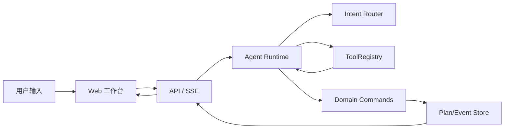
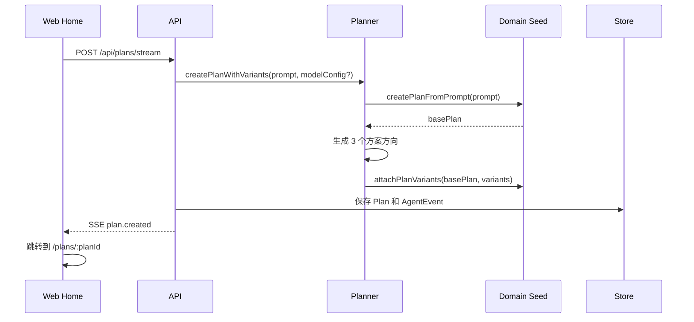
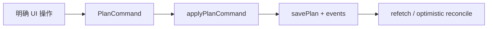
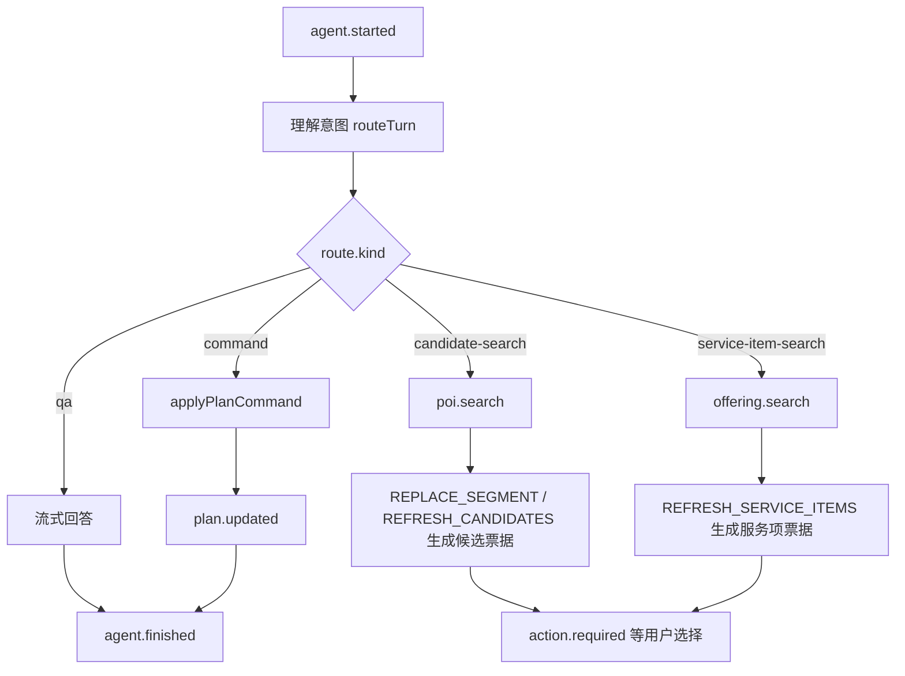
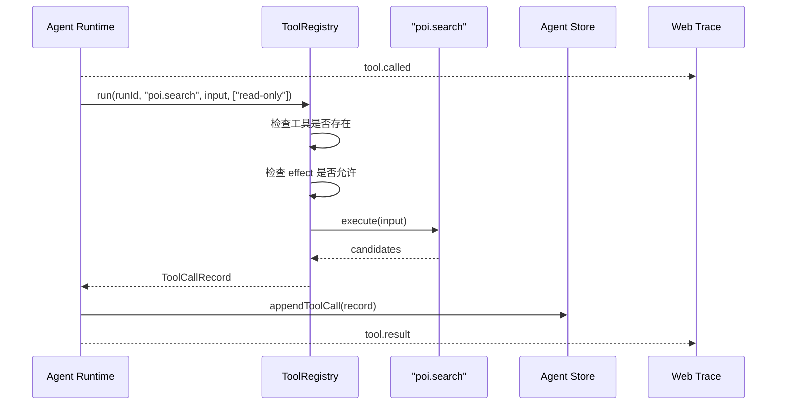
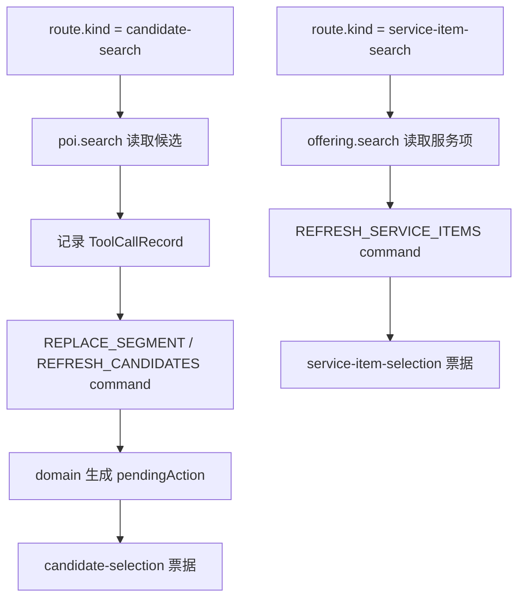
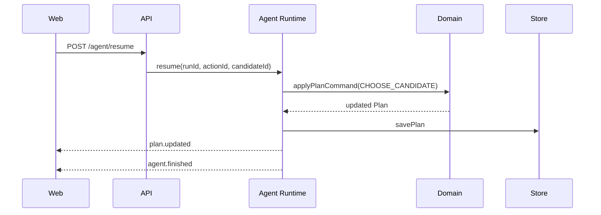

# PlanPal Agent 链路说明

这份文档解释 PlanPal Agentic 的 Agent 设计：自然语言怎样被理解，工具怎样被调用，最终计划怎样被确定性写入。

先给结论：

```text
LLM 负责理解意图和生成建议。
ToolRegistry 负责受控读取外部/本地能力。
packages/domain 负责真正修改 Plan。
```

PlanPal 不是让模型直接改页面，也不是让模型直接覆盖数据库里的计划。模型和工具最多产生“意图、候选、解释、证据”，真正写入必须经过 `PlanCommand`。

## 核心心智模型



三条边界最重要：

- `Router` 判断这句话是问答、候选搜索，还是确定性命令。
- `ToolRegistry` 只能调用注册过的工具，并且要通过 `ToolEffect` 权限检查。
- `Domain Commands` 是唯一能修改 `Plan` 的地方。

## 关键代码位置

- Web SSE 和 API client：`apps/web/src/lib/api.ts`
- 工作台编排：`apps/web/src/routes/PlanWorkspacePage.tsx`
- API routes：`apps/api/src/index.ts`
- Agent runtime：`packages/agent/src/runtime.ts`
- Intent router：`packages/agent/src/router.ts`
- Tool registry：`packages/agent/src/tools.ts`
- Plan commands：`packages/domain/src/commands.ts`
- Plan types：`packages/domain/src/types.ts`
- 本地 POI / fallback seed：`packages/domain/src/seed.ts`、`packages/domain/src/poiCatalog.ts`
- 本地 mock 路线 / sandbox receipt：`packages/domain/src/mockServices.ts`

## 数据结构

### Plan

`Plan` 是当前计划的持久化对象。它包含：

- `intent`：原始 prompt、人数、时间、偏好。
- `segments`：拼图列里的行程节点。
- `pendingAction`：等待用户选择的动作，例如候选替换。
- `variantSelection`：初始 3 个方案的保留状态。
- `routeChoices`：用户手动选过的路线方式。
- `serviceSelections`：用户已选择的商品/服务项快照，例如电影票、酒店房型、套餐。
- `sandboxOrder`：本地 sandbox 模拟确认单，不代表真实预订、下单或支付。
- `currentVersion`：每次确定性写入都会递增。

### PendingAction

`PendingAction` 是 Agent 和用户之间的“决策票据”：

- `plan-variant-selection`：初始方案选择。
- `candidate-selection`：替换或加点候选。
- `service-item-selection`：商户商品/服务项选择，例如房型、电影票、票务、套餐。
- `clarification`：预留给未来补充信息。

它的意义是：Agent 不直接替用户决定，而是把可执行选项交给用户确认。

### PlanCommand

`PlanCommand` 是写计划的唯一入口。常见命令：

- `CHOOSE_PLAN_VARIANT`
- `REPLACE_SEGMENT`
- `CHOOSE_CANDIDATE`
- `REFRESH_CANDIDATES`
- `REORDER_SEGMENT`
- `SET_ROUTE_CHOICE`
- `CLEAR_ROUTE_CHOICE`
- `REFRESH_SERVICE_ITEMS`
- `SELECT_SERVICE_ITEM`
- `REMOVE_SERVICE_ITEM`
- `UPDATE_SERVICE_ITEM_QUANTITY`
- `CONFIRM_PLAN`
- `CREATE_SANDBOX_ORDER`

只要一个能力会修改 `Plan`，就应该优先考虑把它设计成 command。

### AgentEvent

`AgentEvent` 是运行记录，也是前端 Trace、进度条、receipt 的数据来源：

- `agent.started`
- `agent.model.started`
- `agent.model.finished`
- `agent.message.delta`
- `tool.called`
- `tool.result`
- `plan.patch.proposed`
- `plan.updated`
- `action.required`
- `agent.finished`
- `agent.error`

异常类事件也会被记录，但主链路图只画正常路径，避免读者第一次看文档就被错误分支干扰。

## 创建计划链路

用户从首页创建计划时走 `POST /api/plans/stream`。



这里的模型角色：

- 有模型配置时，planner 会请求模型生成方案 JSON。
- 没有模型配置时，直接使用 domain fallback variants。
- 模型返回会经过 parse、coerce、repair、校验。
- 无论方案来自模型还是 fallback，最终都要通过 `attachPlanVariants` 进入 `Plan.pendingAction`。

模型错误、无模型、JSON 修复失败都属于降级策略，文档不把它画进主链路图；调试时看 `agent.model.error` 和 Trace。

## 选择初始方案链路

创建计划后，对话列会出现 3 个方案票据。

```text
用户点击方案
  -> Web buildPlanVariantCommand(actionId, variant)
  -> POST /api/plans/:planId/commands
  -> applyPlanCommand(CHOOSE_PLAN_VARIANT)
  -> 替换 Plan.segments
  -> 清空 pendingAction
  -> 保留 variantSelection，方便之后切换
  -> currentVersion + 1
  -> Web refetch plan
```

这条链路不需要 Agent runtime。用户已经明确选择了一个方案，直接走 command。

## 工作台直接命令链路

拼图列、路线列、确认弹窗里的明确按钮，直接调用 `/commands`：



例子：

- 拖拽/上移/下移：`REORDER_SEGMENT`
- 换一个：`REPLACE_SEGMENT`
- 选择候选：`CHOOSE_CANDIDATE`
- 路线方式：`SET_ROUTE_CHOICE`
- 恢复推荐路线：`CLEAR_ROUTE_CHOICE`
- 商品/服务选择：`SELECT_SERVICE_ITEM`
- 商品/服务移除或改数量：`REMOVE_SERVICE_ITEM` / `UPDATE_SERVICE_ITEM_QUANTITY`
- 确认计划：`CONFIRM_PLAN`
- 生成模拟确认单：`CREATE_SANDBOX_ORDER`

判断标准很简单：如果 UI 已经知道用户要做什么，就不用绕 Agent。当前确认弹窗使用 `CREATE_SANDBOX_ORDER`，domain 会把计划置为 `confirmed` 并生成本地 sandbox receipt；receipt 会优先使用 `serviceSelections` 中的服务快照，没有手动选择的节点会使用默认 mock item fallback。`CONFIRM_PLAN` 仍保留兼容路径，也会生成模拟确认信息。

## Agent 对话链路

用户在对话框输入自然语言时，走 `POST /api/plans/:planId/agent/runs`。



`route.kind` 目前有四类：

- `qa`：只回答，不改计划。
- `command`：可以直接转成确定性命令。
- `candidate-search`：需要先查候选，再让用户选择；可用于替换当前节点，也可用于加点插入空档。
- `service-item-search`：需要先查商户商品/服务项，再让用户选择；用于已有酒店、电影、票务等服务商户节点。

### selectedSegmentId

前端可以给 Agent 传 `selectedSegmentId`：

- 用户选中了某个拼图节点时，Agent 优先把请求作用在这个节点。
- 用户切回全局计划时，不传 `selectedSegmentId`，router 根据语义找目标，例如晚餐、饮品、活动。
- 选中状态是全局 UI 状态，不应该只存在某一列。

## Tool Calling 是怎么设计的

PlanPal 里的 tool calling 不是让 LLM 自由调用任意函数。

当前设计是：

```text
LLM / deterministic router 只决定意图。
Agent runtime 根据 route.kind 决定是否调用工具。
ToolRegistry 只允许调用白名单工具。
ToolEffect 决定工具是否允许在当前阶段执行。
工具结果只作为证据或候选来源，不能直接写 Plan。
```

### 工具注册表

代码位置：`packages/agent/src/tools.ts`

每个工具有：

```ts
type ToolSpec = {
  name: string
  effect: ToolEffect
  description: string
  execute: (input: unknown) => Promise<unknown>
}
```

`ToolEffect` 目前有：

- `read-only`：只读工具，可以在规划阶段调用。
- `external-write`：外部写入工具，例如真实预订、下单。规划阶段默认不允许。

### 当前注册的工具

| 工具 | effect | 当前用途 |
| --- | --- | --- |
| `poi.search` | `read-only` | 根据计划节点、空档锚点和 query 找替换或加点候选。当前 Agent candidate-search 会调用它。 |
| `offering.search` | `read-only` | 查询本地 mock `MerchantOffering`，包括酒店房型、电影场次、票务、套餐和生活服务。 |
| `weather.check` | `read-only` | 确定性天气提示，目前是预留示例，尚未接入主要路由。 |
| `route.estimate` | `read-only` | 基于计划节点坐标生成本地 mock-route 估算，不调用真实地图。 |
| `order.preview` | `read-only` | 预览 sandbox receipt，不产生真实预订、下单或支付。 |
| `order.execute` | `external-write` | 外部写入示例，规划阶段会被 effect gate 阻止。 |

### 工具调用生命周期



这个生命周期有几个关键点：

- `allowedEffects` 是调用点传入的，不是工具自己决定的。
- 当前 candidate-search 只允许 `read-only`。
- 如果未来模型想触发 `order.execute`，runtime 也会因为 effect 不匹配而阻止。
- 工具调用记录会进入 store，Trace 可以展示工具输入、状态和结果。

### 当前 mock API 边界

本阶段不接高德/AMap 或其他真实地图/商户 provider。API 暴露的 mock endpoints 都只读、确定性、纯本地：

- `GET /api/mock/pois`：按 phase、query、tags、area、priceLevel 查询虚构 POI。
- `GET /api/mock/pois/:poiId`：读取虚构 POI 详情。
- `GET /api/mock/merchants`：按 phase/category/query 查询虚构商户。
- `GET /api/mock/merchants/:merchantId`：读取虚构商户详情。
- `GET /api/mock/merchants/:merchantId/offerings`：读取某个商户的 mock 商品/服务。
- `GET /api/mock/offerings`：按 merchantId/category/query/availableAt 查询 mock 商品/服务。
- `GET /api/plans/:planId/mock/routes`：基于计划坐标生成 mock-route 估算。

这些 endpoint 和 Merchant/Map/Trace UI 都必须明确标注 mock/local/sandbox，不得展示成实时营业、实时导航或真实下单结果。

### poi.search / offering.search 和 PlanCommand 的关系

当前 candidate-search 正常路径是：



这里有一个刻意的边界：`poi.search` 和 `offering.search` 的结果不会直接写进 `Plan`。

现在 `poi.search`、`REPLACE_SEGMENT`、`REFRESH_CANDIDATES(mode: add-after)`、`offering.search` 和 `REFRESH_SERVICE_ITEMS` 底层都使用 domain 的 mock catalog/ranking 能力，所以 Trace 里的工具结果和最终票据保持一致。真正被前端当作可选择票据的数据，以 `applyPlanCommand(...)` 生成的 `Plan.pendingAction` 为准。

这样做的好处：

- 工具层保持只读。
- domain 仍是候选票据的权威来源。
- 未来接真实 POI provider 时，可以先把 provider 结果校验/归一化，再进入 command。
- 不会出现“工具返回什么就直接持久化什么”的越权路径。

### 未来扩展工具时怎么做

新增工具建议按这个顺序：

1. 在 `ToolRegistry` 注册工具名、effect、description、execute。
2. 明确它是 `read-only` 还是 `external-write`。
3. 在 runtime 的具体 route 分支里调用它，而不是让模型任意调用。
4. 对工具输入做类型校验。
5. 把工具输出转成候选、证据或 command input。
6. 真正写计划时仍然调用 `applyPlanCommand`。
7. 给 tool success、blocked、failed 补测试。

如果工具会产生真实世界副作用，例如订座、付款、发消息：

- effect 应该是 `external-write`。
- 默认不能在普通规划 run 里执行。
- 必须有用户确认和更严格的 command / audit 设计。

## 候选选择和 resume

当 Agent 产生候选票据时，run 进入 `waiting_for_user`。

```text
pendingAction.kind = "candidate-selection"
```

用户点击候选后：



如果候选是用户直接从 UI 命令触发的，也可以不走 `/agent/resume`，直接向 `/commands` 发送 `CHOOSE_CANDIDATE`。

## QA 链路

用户只是问问题时，不应该修改计划。

例子：

```text
你是什么模型？
为什么这么安排？
当前计划状态怎么样？
```

QA 路径：

```text
route.kind = qa
  -> answerWithModel
  -> agent.message.delta
  -> agent.finished
```

QA 不调用 `applyPlanCommand`，也不会递增 `Plan.currentVersion`。

## 事件如何进入前端

Web 侧主要消费事件的位置：

- `apps/web/src/lib/api.ts`：解析 SSE。
- `apps/web/src/routes/HomePage.tsx`：展示创建计划进度。
- `apps/web/src/routes/PlanWorkspacePage.tsx`：发起 agent run、resume、command mutation。
- `apps/web/src/components/workspace/workspaceModel.ts`：把事件转成聊天气泡、receipt、progress 和 Trace display。

事件和 UI 的关系：

- `agent.started`：展示运行开始。
- `agent.model.started` / `agent.model.finished`：展示模型阶段。
- `agent.message.delta`：拼接流式回答。
- `tool.called` / `tool.result`：Trace 和进度用。
- `plan.patch.proposed`：说明将进入确定性写入或用户决策。
- `action.required`：显示方案/候选票据。
- `plan.updated`：刷新计划和版本。
- `agent.finished`：结束当前 run。

## 异常处理放在哪里看

主链路图不画模型失败和工具失败，但代码里有处理：

- 模型连接或 JSON 解析问题：看 `agent.model.error`。
- 工具不存在、effect 不允许、execute 抛错：看 `ToolCallRecord.status`。
- command 校验失败：API 返回 400，前端显示 command error。
- SSE run 抛错：API 会发 `agent.error`。

调试入口：

- Trace 列
- `packages/agent/src/runtime.ts`
- `packages/agent/src/tools.ts`
- `packages/domain/src/commands.ts`
- `apps/web/src/components/workspace/workspaceModel.ts`

## BYOK 安全边界

用户模型配置从浏览器传到 API：

```text
Authorization: Bearer <apiKey>
X-Model-Base-URL
X-Model-Name
X-Model-Provider-Mode
X-Model-Resolved-Base-URL
```

要求：

- API key 不进入 Plan。
- API key 不进入 AgentEvent。
- API key 不进入 ToolCallRecord。
- API key 不进入 version history。
- 报错要经过 redaction。

## 新增 Agent 能力 Checklist

1. 这句话应该落到 `qa`、`command`，还是 `candidate-search`？
2. 如果要调用工具，工具是只读还是外部写入？
3. runtime 是否明确传入了允许的 `ToolEffect`？
4. 工具输出是否经过校验和归一化？
5. 最终写 Plan 是否仍然经过 `PlanCommand`？
6. 前端是否用 `action.required` 展示用户必须确认的选择？
7. Trace 是否能看见 model/tool/command 的关键事件？
8. 是否补了 domain、agent、web helper 测试？
